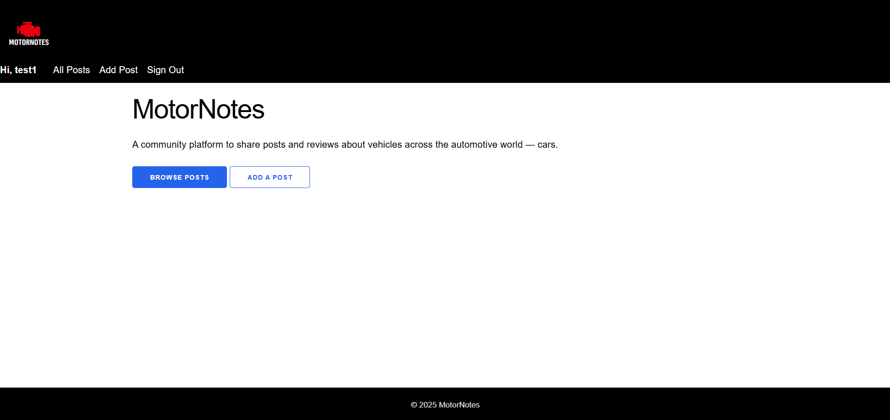
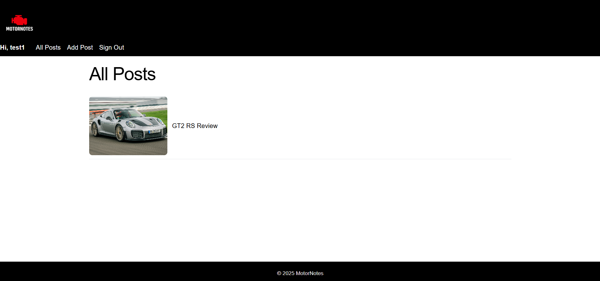
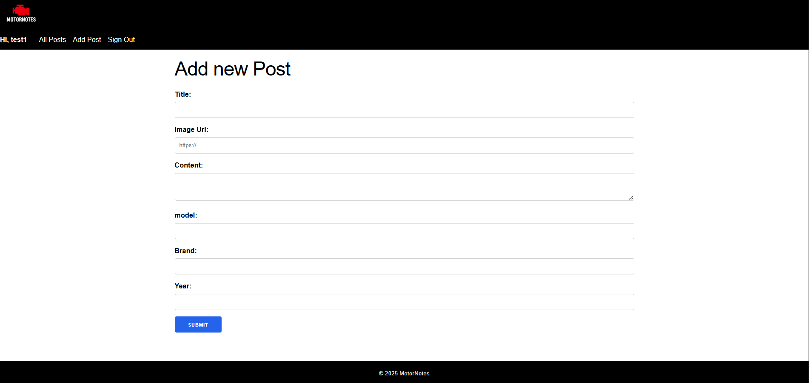
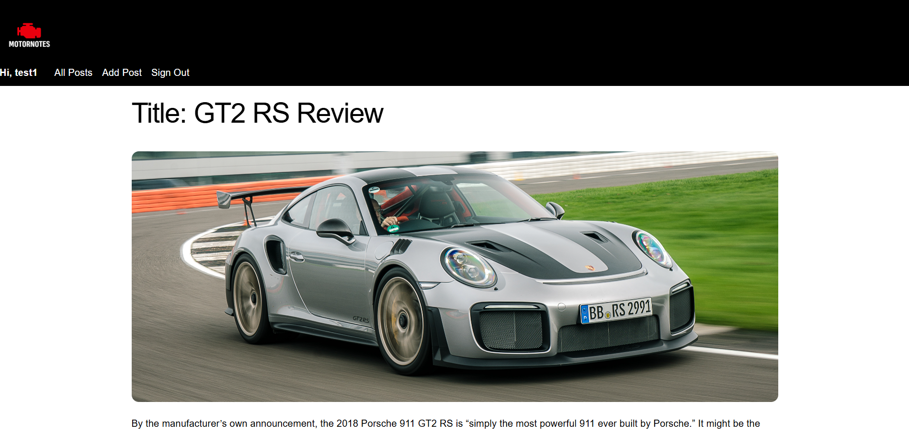
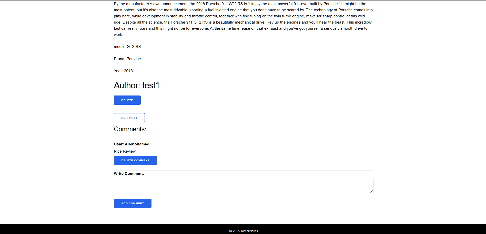

# MotorNotes

MotorNotes is a full-stack web application that allows users to create, read, update, and delete posts reviewing vehicles across the automotive world, including cars, bikes, and other motor vehicles.  
Users can register, sign in, create posts with images, and interact by adding and managing comments.

This project was built to demonstrate full CRUD functionality, authentication, authorization, and database relationships using Node.js, Express, MongoDB, and EJS.

---

## 🚗 Features

- User authentication (Sign Up / Sign In / Sign Out)
- Full CRUD for posts
- Image support for posts (via image URL)
- Comment system with ownership control
- Authorization (only owners can edit/delete their content)
- Responsive UI using Milligram CSS


---

## Technologies Used

- **Node.js** – JavaScript runtime  
 

- **Express.js** – Web framework  
  

- **MongoDB & Mongoose** – 

- **EJS** – Server-side templating  
  

- **Express Session & Connect-Mongo** – Authentication sessions  
  https://www.npmjs.com/package/express-session  
  https://www.npmjs.com/package/connect-mongo

- **Milligram CSS** – Minimal CSS framework  
  https://milligram.io/

---

## Project Structure
```
MOTOR-NOTES/
│
├── config/
│ └── database.js
│
├── controllers/
│ ├── auth.js
│ └── posts.js
│
├── middleware/
│ ├── is-signed-in.js
│ └── pass-user-to-view.js
│
├── models/
│ ├── user.js
│ └── post.js
│
├── public/
| └── screenshots/
|   ├── homepage.png
|   ├── all-posts.png
|   ├── add-post.png
|   └── post-page1.png
|   └── post-page2.png
│ └── stylesheets/
│ ├── milligram.min.css
│ └── style.css
│
├── views/
│ ├── auth/
│ ├── posts/
│ └── partials/
│
├── server.js
├── package.json
└── README.md

```

## Data Models

### User
- username
- password (hashed)
- session-based authentication

### Post
- title
- image URL
- content
- model
- brand
- year
- author (reference to User)
- embedded comments

### Comment (Embedded)
- text
- author (reference to User)
- timestamps

MongoDB automatically generates unique Ids for all documents.

---

## 🔐 Authentication & Authorization

-User authentication is implemented using a session-based approach with Express Session and MongoDB.

-An authentication template provided during coursework was used as a starting point and then integrated, customized, and extended to fit the MotoNotes application.

-Authorization rules ensure:

-Only authenticated users can access posts

-Only post owners can edit or delete their posts

-Only comment owners or post owners can delete comments

---

## 🎨 Styling & UI

- Milligram CSS is used for base styling and layout
- Custom CSS overrides are applied for branding and colors
- Flexbox is used for navigation layout
- Clean, bright UI with consistent header and footer

Milligram documentation:  
https://milligram.io/

---

## How to Run Locally

1. Clone the repository

2. Install dependencies:
   ```bash
   npm install
   ```
Create a .env file:

env
```
MONGODB_URI=your_mongodb_connection_string

SESSION_SECRET=your_secret_key
```
3. Start the server:
 ```bash
npm run dev
```
4. Open browser at:
http://localhost:3000

## 📸 Screenshots


### Home page:


### All posts page


### Add post form


### Post details with comments





## Future Improvements
- Image upload instead of image URLs

- Categories for vehicle types

- Search and filter posts

- User profiles

- Pagination for posts

- pop-up messages
